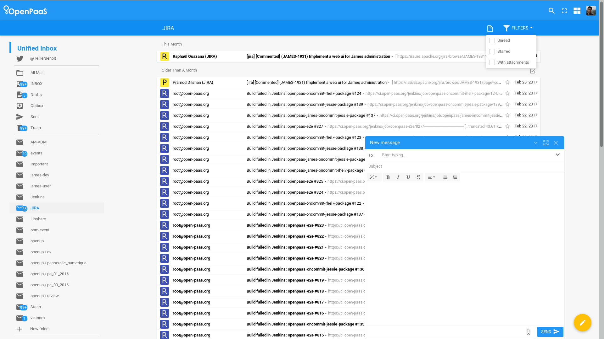
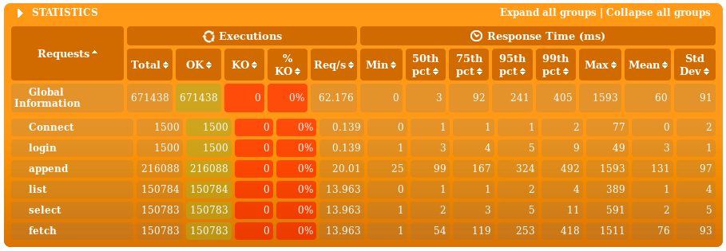
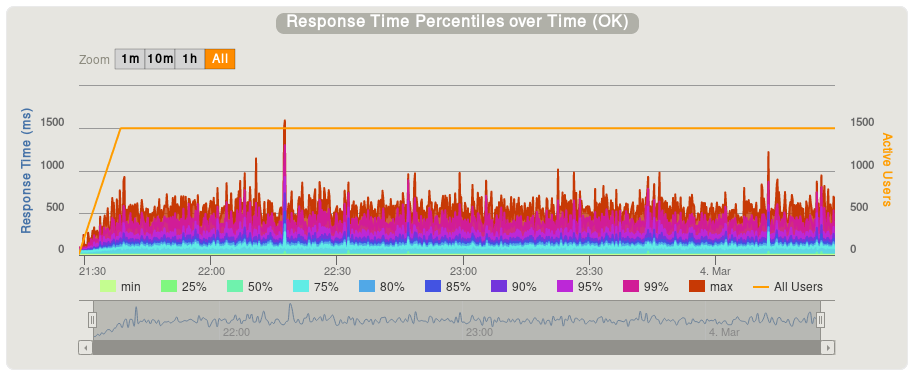
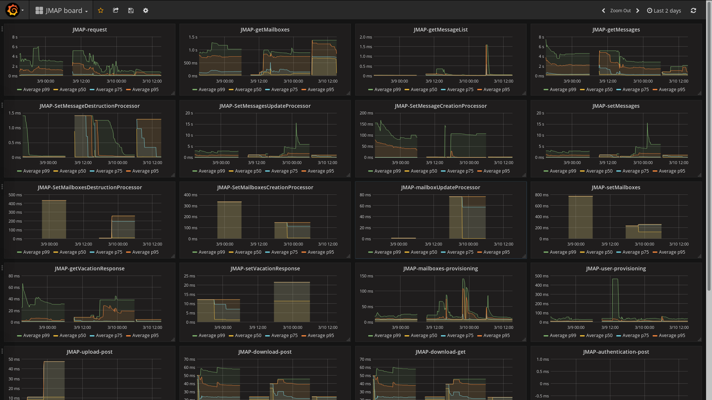
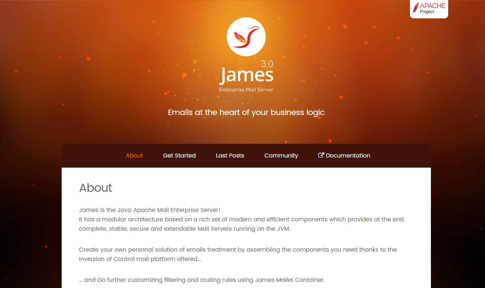

# Linagora's James newsletter

[Linagora](http://linagora.com/) have a team of developpers devoted to the James server. We are already contributing for a few years to the project. This document will try to give you information about what we recently did for the James project, and give hints about the road-map we follow. We will also try to write it regulary.

## Deploying James internally

We now use James as the mail server behind [OpenPaaS](http://open-paas.org/). Thus we deployed it and use it on an every-day base.

Our deployment is based on the following components :
 - We enabled IMAP, SMTP and [JMAP](http://jmap.io/) protocols
 - We use [Cassandra](http://cassandra.apache.org/) for storing e-mails
 - We rely on [ElasticSearch](https://www.elastic.co/fr/products/elasticsearch) for searching e-mails
 - We authenticate our users with LDAP
 - We use [Guice](https://github.com/google/guice/wiki/GettingStarted) for bringing all pieces together.
 - We plan to bring soon Sieve and ManageSieve part of this deployment as many peaple request filtering.

Let me share a few numbers with you :

 - We handle about 100 users
 - We have so far a number of 1.500.000 e-mails, that we imported using [IMAP-sync](https://imapsync.lamiral.info/) scripts
 - We receive around 15.000 incoming e-mails a day
 - We execute 42.500 IMAP commands a day
 - We answer 20.000 JMAP requests a day

This deployment help us detecting bugs, and performance issues. We follow the current state of master branch, that we update at midnight 
with the built image uploaded on [dockerhub](https://hub.docker.com/r/linagora/james-ldap-project/).

## Tracking performance

Everybody wants to read their e-mails fast. Thus the team made performance tracking a priority. And we developed the tools to follow performance.

We started implementing [Gatling](http://gatling.io/) load testing for the James server :

  - First with a [Gatling JMAP](https://github.com/linagora/james-gatling) implementation.
  - Then we added a naive SMTP implementation
  - And finally contributed a [IMAP DSL for Gatling](https://github.com/linagora/gatling-imap)

Running these load tests we :

  - Succeeded to support 1.000 thunderbird like users
  - However, it turned out we had problems with 10.000 users.

Additionally, we added metrics a bit everywhere in James using the brand new metrics API. We collect and export everything in [ElasticSearch](https://github.com/elastic/elasticsearch-metrics-reporter-java) using [Dropwizard metrics](http://metrics.dropwizard.io/3.2.1/). Then we graph it all using [Grafana](http://grafana.com/). This allow us to collect all statistic and percentiles. We track so far :

  - Protocols detailed time execution (and count)
  - Percentile of mailet and matcher executions
  - Enqueue and Dequeue time
  

All these solutions allow us to identify the components that needs improvement. For instance receiving too much incoming e-mails overload James with very heavy garbage collection. We then plan to move our mail queue to RabbitMQ, to parse e-mails only once on top of the mail pipeline, to reorganize a bit our configuration. A Camel upgrade (impossible in java-6) might also help.
 
 ## MessageId refactoring
 
 We succeeded to finish and merge the MessageId refactoring. This huge task allow us to address messages by their ID, outside of mailbox context.
 
 This is required for JMAP protocol implementation.
 
 This is now supported by the Cassandra and Memory implementation. We design a system of capabilities to allow enabling only the supported parts of protocols, in an implementation agnostic way.
 
 ## Our incoming plans
 

We are pretty happy with the current state of the James server. We will then push for the 3.0 release of the James server.

For this :

  - We need to do some load testing on top of JPA implementation
  - We will continue doing bug fixes
  - We need some additional performance enhancement, especially with IMAP SELECT command on large mailboxes
  - We plan to start working again on the new website, which have been paused a few months

## Usefull links

 - Gatling: http://gatling.io/
 - Gatling James (JMAP + SMTP): https://github.com/linagora/james-gatling
 - Gatling IMAP: https://github.com/linagora/gatling-imap
 - Dopwizard metrics: http://metrics.dropwizard.io/3.2.1/
 - ElasticSearch metrics: https://github.com/elastic/elasticsearch-metrics-reporter-java
 - Grafana: http://grafana.com/
 - JMAP: http://jmap.io/
 - OpenPaaS: http://open-paas.org/
 - Linagora: http://linagora.com/
 - Cassandra: http://cassandra.apache.org/
 - ElasticSearch: https://www.elastic.co/fr/products/elasticsearch
 - Guice: https://github.com/google/guice/wiki/GettingStarted
 - Our James image on DockerHub: https://hub.docker.com/r/linagora/james-ldap-project/
 - IMAP sync scripts: https://imapsync.lamiral.info/

 
 
 
 
 
 
 
